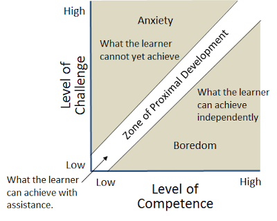

```{r setup, include=FALSE}
knitr::opts_chunk$set(fig.width=6, fig.asp=.8,
                      echo=FALSE, warning=FALSE, message=FALSE, cache=T)

library("papaja")
library(knitr)
library(ZPDGrowthTrajectories)
library(ggplot2)
library(dplyr)
library(cowplot)
library(ggridges)
library(viridis)
library(cowplot)
library(extrafont)
library(reshape2)
library(trapezoid)


# from https://stackoverflow.com/questions/25646333/code-chunk-font-size-in-rmarkdown-with-knitr-and-latex
def.chunk.hook  <- knitr::knit_hooks$get("chunk")
knitr::knit_hooks$set(chunk = function(x, options) {
  x <- def.chunk.hook(x, options)
  ifelse(options$size != "normalsize", paste0("\\", options$size,"\n\n", x, "\n\n \\normalsize"), x)
})

## functions for making the plots

# modify the visualizeTrajectories function to add a legend and tweak the size and transparency of the 
#   lines

visualizeTrajectories2 <- function(trajectories) {
    if (ncol(trajectories) != 3) {
        nstudents <- nrow(trajectories)
        days <- ncol(trajectories) - 1
        trajectories <- reshape2::melt(trajectories, measure.vars = c(1:days + 
            1))
        trajectories[, 2] <- rep(seq(1:days), each = nstudents)
        names(trajectories) <- c("student", "day", "achievement")
        trajectories <- trajectories[order(trajectories$student), ]
    }
    p <- ggplot(data = trajectories, aes(x = day, 
        y = achievement, color = factor(student))) + geom_line(
        size = 0.6, alpha = 0.6) + geom_hline(yintercept = 0, 
        col = "gray") + geom_vline(xintercept = 0, col = "gray") + 
        theme(panel.background = element_blank(), 
            panel.grid.major = element_blank(), panel.grid.minor = element_blank())
    return(p)
}


# function for plotting the trajectories and gaps

plotGaps <- function(assignment, learning.rates, decay.rates, initial.achievements, home.environments, dosage=.66, curriculum.starts, curriculum.widths, scale.intercept=118.5, scale.slope=245, ach.max=260, gap.max=60, days.to.sample=1825+seq(0, by=356, length.out=7)) {

  # generate the trajectories
  
  trajectories <- ZPDGrowthTrajectories(output.format="wide",
         days=4015,
         assignment=assignment, 
         curriculum.start.points=curriculum.starts, 
         curriculum.widths=curriculum.widths,
         dosage=dosage,
         learning.rates=learning.rates,
         decay.rates=decay.rates,
         initial.achievements=initial.achievements,
         home.environments=home.environments,
         integration.points=200,
         curriculum.lower.slope=8,
         curriculum.upper.slope=10000,
         alpha=1,
         home.curriculum.shape1=1,
         home.curriculum.shape2=5,
         zpd.offset=.026,
         zpd.sd=.039,
         zpd.scale=.05,
         decay.weight=.005,
         useGPU=FALSE,
         verbose=FALSE)
  
  # rescale the achievement values to MAP scale
  trajectories[,2:ncol(trajectories)] <- apply(trajectories[,2:ncol(trajectories)], c(1,2), function(x) {scale.intercept+(x*scale.slope)})

  # make the plot of trajectories (panel 1)
  p1 <- visualizeTrajectories2(trajectories)+
   xlim(0,3903)+ylim(100, ach.max)+  #1826
    labs(y="MAP score", color="Student")+
    geom_vline(xintercept=seq(1826, 3901, by=365), linetype="solid", alpha=.2)+
    geom_vline(xintercept=seq(1826+365-113, 4100, by=365), linetype="solid", alpha=.2)+
   annotate("text", x = seq(1826+110, 4100, by=365), y = 120, label = c(" K ", "1st", "2nd", "3rd", "4th", "5th"), family="Times", size=3.2)+
    theme(legend.position=c(.06, .75),
          axis.text.x=element_blank(),
          axis.title.x=element_blank(),
          axis.ticks.x=element_blank(),
          axis.text.y=element_text(family="Times", size=15),
          axis.title.y=element_text(family="Times", size=15),
          legend.text=element_text(family="Times", size=15),
          legend.title=element_text(family="Times", size=15))

  # calculate the gaps by differencing student 3-2 and student 3-1
  e_gap <- trajectories[3,2:ncol(trajectories)] - trajectories[2,2:ncol(trajectories)]
  a_gap <- trajectories[3,2:ncol(trajectories)] - trajectories[1,2:ncol(trajectories)]

  # bind into data frame. Gap type is varname "student" to enable visualizeTrajectories2 to be used
  student <- c("Excellence", "Achievement")
  gaps <- cbind(student, rbind(e_gap, a_gap))

  # make the plot 
  p2 <- visualizeTrajectories2(gaps)+
    xlim(0,3903)+ylim(-10, gap.max)+
    labs(y="Gap", color="Type")+
    geom_vline(xintercept=seq(1826, 3901, by=365), linetype="solid", alpha=.2)+
    geom_vline(xintercept=seq(1826+365-113, 4100, by=365), linetype="solid", alpha=.2)+
   annotate("text", x = seq(1826+110, 4100, by=365), y = -7, label = c(" K ", "1st", "2nd", "3rd", "4th", "5th"), family="Times", size=3.2)+
    # these color codes are ColorBrewer set1 colors 4 and 5
    scale_colour_manual(values = c("#984ea3", "#ff7f00"))+
    theme(legend.position=c(.06, .8),
          axis.text.x=element_blank(),
          axis.title.x=element_blank(),
          axis.ticks.x=element_blank(),
          axis.text.y=element_text(family="Times", size=15),
          axis.title.y=element_text(family="Times", size=15),
          legend.text=element_text(family="Times", size=15),
          legend.title=element_text(family="Times", size=15))


  gap.summary <- gaps[,c(1, days.to.sample+1)]
  names(gap.summary) <- c("Type", "GradeK", "Grade1", "Grade2", "Grade3", "Grade4", "Grade5", "Grade6")
  gap.summary <- melt(gap.summary)
  
  ach.summary <- trajectories[,c(1, days.to.sample+1)]
  names(ach.summary) <- c("Student", "GradeK", "Grade1", "Grade2", "Grade3", "Grade4", "Grade5", "Grade6")
  ach.summary <- melt(ach.summary, id.vars="Student")
  ach.summary <- ach.summary[order(ach.summary$Student),]

  nstudents <- nrow(trajectories)
  days <- ncol(trajectories) - 1
  trajectories <- reshape2::melt(trajectories, measure.vars = c(1:days + 
      1))
  trajectories[, 2] <- rep(seq(1:days), each = nstudents)
  names(trajectories) <- c("student", "day", "achievement")
  trajectories <- trajectories[order(trajectories$student), ]
  
  nstudents <- nrow(gaps)
  days <- ncol(gaps) - 1
  gaps <- reshape2::melt(gaps, measure.vars = c(1:days + 
      1))
  gaps[, 2] <- rep(seq(1:days), each = nstudents)
  names(gaps) <- c("student", "day", "achievement")
  gaps <- gaps[order(gaps$student), ]
  
  return(list(p1=p1, p2=p2, gap.summary=gap.summary, ach.summary=ach.summary, 
              trajectories=trajectories, gaps=gaps))
}

```


## Open materials!

This slideshow

[http://rpubs.com/mmcbee/origin](http://rpubs.com/mmcbee/origin)

&nbsp;

Preprint of the paper 

[https://psyarxiv.com/8a5qs](https://psyarxiv.com/8a5qs)

&nbsp;

OSF project page with paper, code, slides, and supporting materials

[https://osf.io/vs9hp/](https://osf.io/vs9hp/)

<div align="right">

</div>

## The Matthew Effect

- As one Nobel interviewee stated, “The world… tends to give the credit to already famous people” (Merton, 1988, p. 607). 

- “For whoever has will be given more, and they will have an abundance. Whoever does not have, even what they have will be taken from them." Matthew 25:29. NIV

- Further widening the gap between those who had from those who had not

## Excellence and Achievement gaps

- Matthew Effects are particularly relevant for gifted education due to pervasive excellence gaps. Excellence gaps represent performance differences between sub-groups at the high end of achievement (Plucker and Peters, 2016)

- <div align="center">

</div>


## Ceci and Papierno (2005)

- Matthew Effects have been found in numerous domains

- Those who had an initial advantage or accomplishment, reaped not just rewards, but outsized rewards

- Relevant for policy decision

- Who gets the interventions?

## ZPD

<div align="center">

</div>

## Origin of the Matthew Effect {.smaller}

```{r origin, fig.asp=.55, fig.cap="", cache=FALSE}

# origin of the Matthew effect

x <- seq(0,1,.01)
y1 <- .45*x - .2*x^2
y2 <- .55*x - .2*x^2
y3 <- .65*x -.2*x^2

matthew <- data.frame(cbind(rep(x,3), c(y1, y2, y3), rep(1:3, each=length(x))))
names(matthew) <- c("time", "achievement", "student")

ggplot(data=matthew, aes(x=time, y=achievement, color=factor(student)))+
  geom_line(alpha=.6)+theme_classic()+
  #coord_cartesian(xlim=c(0,.8))+
  labs(x="Time", color="Student")+
  geom_vline(xintercept=.5, linetype="dashed", alpha=.5)+
  theme(
    legend.position="bottom",
    axis.text.x=element_blank(),
          axis.title.x=element_text(family="Times", size=11),
          axis.ticks.x=element_blank(),
          axis.ticks.y=element_blank(),
          axis.text.y=element_blank(),
          axis.title.y=element_text(family="Times", size=11),
          legend.text=element_text(family="Times", size=11),
          legend.title=element_text(family="Times", size=12))+
 annotate(geom="point", x=c(.5, .5, .5), y=c(.175, .225, .275), 
           color=c("red", "green", "blue"), alpha=.55)
```

Origin of the Matthew effect. *X*-axis: time. *Y*-axis: achievement. Students are observed at a time point denoted by the vertical dashed line. The process creating the discrepancies in achievement at time *t* will continue unless interrupted or constrained, resulting in growing inequality in achievement over time.

## ZPDGrowthTrajectories model

- Uses a quantitative theoretical model to understand the consequences of various interventions on achievement and excellence gaps.  

-  Model generates synthetic acheivement growth trajectories.

- Implemented as an `R` package [https://github.com/mcbeem/ZPDGrowthTrajectories](https://github.com/mcbeem/ZPDGrowthTrajectories)

- Model is based on four underlying variables:
    * The child’s basic learning rate, 
    * The educational quality of the child’s home environment 
    * How quickly the child forgets things learned 
    * Educational experiences to which the child is exposed in school


## Model equations

\small
\begin{equation}
\begin{split}
\textit{Learning}_{ti} = & (\textit{LearnRate}_i) \, \times \,  \\
  & \big[ ( \textit{dosage}_{ti})  \int_{0}^{\infty} \textit{ZPD}_{ti}(x) * S_t(x) \, dx  + \\ 
  & (1-\textit{dosage}_{ti}) (\textit{HomeEnv}_i)  \int_{0}^{\infty} \textit{ZPD}_{ti}(x) * H_t(x) \, dx \big]
\end{split}
\end{equation}
\normalsize

where * denotes the pointwise product, $LearnRate_i$ the $i$th student’s learning rate, $HomeEnv_i$ the $i$th student’s home environment, dosage a constant between 0 and 1 that describes the relative exposure to school versus home during academic years, $x$ denotes achievement, $ZPD_it(x)$ denotes the function describing the $i$th student’s zone of proximal development at time $t$, $S_t(x)$ denotes the function describing the home curriculum at time $t$, and $H_t(x)$ the function describing the home curriculum at time $t$.

## Model equations

Achievement is updated for time interval $t$ by adding the amount of learning during that interval to the student’s prior achievement and then multiplying the result by a value slightly smaller than 1.0 to model decay due to forgetting. 

\begin{equation}
\textit{Achievement}_{i,t}=(\textit{Achievement}_{i,t-1} + \textit{Learning}_{i,t})(1 - \textit{Decay}_i)
\end{equation}

## NWEA MAP national norms by subject and grade.

```{r MAPnorms, fig.asp=.8}

MAP.2015.norms.reading <-
  # subject # grade  # time  # subject # mean # SD
  matrix(c(
    rep(1, times=12*3),
    rep(seq(0,11), each=3),
    rep(c(1,2,3), times=12),
    c(141.0, 151.3, 158.1, 
      160.7, 171.5, 177.5,
      174.7, 184.2, 188.7,
      188.3, 195.6, 198.6,
      198.2, 203.6, 205.9,
      205.7, 209.8, 211.8,
      211.0, 214.2, 215.8,
      214.4, 216.9, 218.2,
      217.2, 219.1, 220.1,
      220.2, 221.3, 221.9,
      220.4, 221.0, 221.2,
      222.6, 222.7, 222.3),
    c(13.54, 12.72, 12.85, 
      13.08, 13.54, 14.54,
      15.52, 14.98, 15.21,
      15.85, 15.14, 15.10,
      15.53, 14.96, 14.92,
      15.13, 14.65, 14.72,
      14.94, 14.53, 14.66,
      15.31, 14.98, 15.14,
      15.72, 15.37, 15.73,
      15.68, 15.54, 16.21,
      16.85, 16.70, 17.48, 
      16.75, 16.53, 17.68)),
    ncol=5) %>% data.frame()

names(MAP.2015.norms.reading) <- c("Subject", "Grade", "Time", "Mean", "SD")

MAP.2015.norms.math <-
  # subject # grade  # time  # subject # mean # SD
  matrix(c(
    rep(2, times=12*3),  # 2 for math
    rep(seq(0,11), each=3),  # first number is starting grade, 2nd is ending grade
    rep(c(1,2,3), times=12),  # 12 is the number of years of data
    c(140.0, 151.5, 159.1,  # means: begin middle end
      162.4, 173.8, 180.8,
      176.9, 186.4, 192.1,
      190.4, 198.2, 203.4,
      201.9, 208.7, 213.5,
      211.4, 217.2, 221.4,
      217.6, 222.1, 225.3,
      222.6, 226.1, 228.6,
      226.3, 229.1, 230.9,
      230.3, 232.2, 233.4,
      230.1, 231.5, 232.4,
      233.3, 234.4, 235.0),
    c(15.06, 13.95, 13.69,  # SDs: begin middle end
      12.87, 12.96, 13.63,
      13.22, 13.11, 13.54,
      13.10, 13.29, 13.81,
      13.76, 14.27, 14.97,
      14.68, 15.33, 16.18,
      15.53, 16.00, 16.71,
      16.59, 17.07, 17.72,
      17.85, 18.31, 19.11,
      18.13, 18.62, 19.52,
      19.60, 20.01, 20.96, 
      19.95, 20.18, 21.30)),
    ncol=5) %>% data.frame()

names(MAP.2015.norms.math) <- c("Subject", "Grade", "Time", "Mean", "SD")

MAP.2015.norms.language <-
  # subject # grade  # time  # subject # mean # SD
  matrix(c(
    rep(3, times=10*3),  # 2 for math
    rep(seq(2,11), each=3),  # first number is starting grade, 2nd is ending grade
    rep(c(1,2,3), times=10),  # 12 is the number of years of data
    c(174.5, 184.9, 189.7,  # means: begin middle end
      189.4, 196.8, 200.0,
      198.8, 204.4, 206.7,
      205.6, 209.7, 211.5,
      210.7, 213.9, 215.3,
      214.0, 216.5, 217.6,
      216.2, 218.1, 219.0,
      218.4, 219.7, 220.4,
      218.9, 219.7, 220.1,
      221.5, 222.1, 222.1),
    c(16.58, 15.34, 15.47,  # SDs: begin middle end
      15.20, 14.24, 14.11,
      14.66, 13.83, 13.64,
      13.87, 13.23, 13.19,
      13.79, 13.30, 13.38,
      13.82, 13.52, 13.70,
      14.17, 13.92, 14.26,
      14.15, 13.98, 14.50,
      15.04, 14.99, 15.74,
      14.96, 14.85, 15.80)),
    ncol=5) %>% data.frame()

names(MAP.2015.norms.language) <- c("Subject", "Grade", "Time", "Mean", "SD")

MAP.2015.norms.science <-
  # subject # grade  # time  # subject # mean # SD
  matrix(c(
    rep(4, times=8*3),  # 2 for math
    rep(seq(3,10), each=3),  # first number is starting grade, 2nd is ending grade
    rep(c(1,2,3), times=8),  # 12 is the number of years of data
    c(187.5, 192.6, 195.4,  # means: begin middle end
      194.6, 198.7, 201.0,
      200.2, 203.7, 205.7,
      204.3, 207.1, 208.6,
      207.2, 209.5, 210.9,
      210.3, 212.3, 213.5,
      212.4, 213.9, 214.8,
      213.4, 214.5, 215),
    c(11.74, 10.92, 11.01,  # SDs: begin middle end
      11.16, 10.75, 10.92,
      11.06, 10.80, 11.07,
      11.54, 11.40, 11.73,
      11.92, 11.87, 12.23,
      12.28, 12.19, 12.63,
      12.83, 12.78, 13.32,
      13.76, 13.72, 14.29)),
    ncol=5) %>% data.frame()

names(MAP.2015.norms.science) <- c("Subject", "Grade", "Time", "Mean", "SD")

# bind the subject datasets together
MAP.2015.norms <- rbind(MAP.2015.norms.reading, MAP.2015.norms.math, MAP.2015.norms.language,  MAP.2015.norms.science)

MAP.2015.norms$Subject <- factor(MAP.2015.norms$Subject, labels=c("Reading", "Math", "Language", "Science"))


#create function for making the plots
score <- seq(50, 300, by=1)
MAP.norms.for.plotting <- cbind(MAP.2015.norms[rep(1:nrow(MAP.2015.norms), each=length(score)), ], score)

#looping here 'cause i'm having trouble with mapply and don't care about style points
for (i in 1:nrow(MAP.norms.for.plotting)) {
   MAP.norms.for.plotting$density[i] <- dnorm(x=MAP.norms.for.plotting$score[i], 
                                        mean=MAP.norms.for.plotting$Mean[i],
                                        sd=MAP.norms.for.plotting$SD[i])
}

MAP.norms.for.plotting$density[MAP.norms.for.plotting$density<.0001] <- NA
 
 makeplot <- function(subject, time) {
 
  a <- ggplot(data=filter(MAP.norms.for.plotting, Time==time, Subject==subject), 
              aes(x = score, y = (factor(Grade)), height=density, fill = ..x..)) +
  geom_ridgeline_gradient(gradient_lwd = 1, scale=70) +
   scale_x_continuous(minor_breaks=seq(100, 300, 50), breaks=seq(100, 300, 50)) +
    coord_cartesian(xlim=c(100, 300))+
   scale_y_discrete(expand = c(0.01, 0),  
                    limits=c("0", "1", "2", "3", "4", "5", "6", "7", "8", "9", "10", "11")) +
   scale_fill_viridis(name = "y", option = "D", direction=-1, alpha=.5) +
   labs(title = paste0(subject))+
   theme_ridges(font_size = 12, grid = TRUE) + 
   theme(axis.title.y = element_blank(), 
         axis.title.x = element_blank(),
         text=element_text(family="Times", size=10),
         legend.position="none")
  
  return(a)
 }
 
reading <- makeplot(subject="Reading", time=1)
math <- makeplot(subject="Math", time=1)
language <- makeplot(subject="Language", time=1)
science <- makeplot(subject="Science", time=1)

plot_grid(reading, math, language, science, ncol=2)

```

## Representation of current achievement and the ZPD {.smaller}

```{r ZPD, fig.asp=.4, fig.cap="The student's current level of achievement in a particular subject is represented by the vertical line. The student's ZPD is the shaded curve. Instruction is effective at producing academic growth when it aligns with this range."}

ach <- .25
x <- seq(0,1,.001)

zpd.offset <- .023
zpd.sd <- .012

zpd <- dnorm(x, ach+zpd.offset, zpd.sd) / max(dnorm(x, ach+zpd.offset, zpd.sd))

a <- cbind(x, zpd, 0)

d <- data.frame(a)
names(d) <- c("x", "y", "curve")

shade1 <- data.frame(rbind(c(0, 0), subset(a, (x >= 0 & x <= 1)), 
               c(1, 0)))

names(shade1) <- c("x", "y", "curve")

ggplot(d, aes(x=x, y=y, group=curve)) + geom_line() + geom_vline(xintercept = ach, 
    col = "black", cex = 0.75, alpha = 0.8) + 
    xlim(.15, .6)+ylim(0,1.1)+
    geom_polygon(data = shade1, aes(x, y), fill = "blue", alpha = 0.25)+
    theme_classic()+xlab("achievement")+ylab("intensity")+
    theme(axis.text.x=element_text(family="Times", size=15),
          axis.title.x=element_text(family="Times", size=15, 
            margin = margin(t = 0, r = 20, b = 1, l = 0)),
          axis.text.y=element_blank(),
          axis.title.y=element_text(family="Times", size=15),
          legend.text=element_text(family="Times", size=11),
          legend.title=element_text(family="Times", size=12)) 
```


## Interaction of the ZPD with the school curriculum function {.smaller}

```{r schoolCurr, fig.asp=.85, fig.cap="The growth rate during interval t is proportional to the intersection area of the ZPD curve (blue) with the school curriculum function (red)."}

plotit <- function(ach, xtext=F) {

  x <- seq(0,1,.001)

  zpd.offset <- .023
  zpd.sd <- .012
  
  curr.min <- .3
  curr.max <- curr.min+.07
  
  zpd <- dnorm(x, ach+zpd.offset, zpd.sd) / max(dnorm(x, ach+zpd.offset, zpd.sd))

  schcurr <- dtrapezoid(x, mode1=curr.min, mode2=curr.max, n1=300, n3=300, alpha=1) 
  schcurr <- schcurr / max(schcurr)
  
  a <- cbind(x, zpd, 0)
  b <- cbind(x, schcurr, 1)
  
  d <- data.frame(rbind(a,b))
  names(d) <- c("x", "y", "curve")
  
  
  shade1 <- data.frame(rbind(c(0, 0), subset(a, (x >= 0 & x <= 1)), 
                 c(1, 0)))
  
  shade2 <- data.frame(rbind(c(0, 0), subset(b, (x >= 0 & x <= 1)), 
                  c(1, 0)))
  
  names(shade1) <- c("x", "y", "curve")
  names(shade2) <- c("x", "y", "curve")
  
  if (xtext==TRUE) {
    plot1 <- ggplot(d, aes(x=x, y=y, group=curve)) + geom_line() + geom_vline(xintercept = ach, 
      col = "black", cex = 0.75, alpha = 0.8) + 
      xlim(.15, .6)+ylim(0,1.1)+
      geom_polygon(data = shade1, aes(x, y), fill = "blue", alpha = 0.25)+
      geom_polygon(data = shade2, aes(x, y), fill = "red", alpha = 0.1)+
      theme_classic()+xlab("achievement")+ylab("intensity")+
      theme(axis.text.x=element_text(family="Times", size=15),
            axis.title.x=element_text(family="Times", size=11),
            axis.text.y=element_blank(),
            axis.title.y=element_text(family="Times", size=15),
            legend.text=element_text(family="Times", size=11),
            legend.title=element_text(family="Times", size=12)) }
  
  if (xtext==FALSE) {
    plot1 <- ggplot(d, aes(x=x, y=y, group=curve)) + geom_line() + geom_vline(xintercept = ach, 
      col = "black", cex = 0.75, alpha = 0.8) + 
      xlim(.15, .6)+ylim(0,1.1)+
      geom_polygon(data = shade1, aes(x, y), fill = "blue", alpha = 0.25)+
      geom_polygon(data = shade2, aes(x, y), fill = "red", alpha = 0.1)+
      theme_classic()+xlab("achievement")+ylab("intensity")+
      theme(axis.text.x=element_text(family="Times", size=15),
            axis.title.x=element_text(family="Times", size=15),
            axis.text.y=element_blank(),
            axis.title.y=element_text(family="Times", size=15),
            legend.text=element_text(family="Times", size=11),
            legend.title=element_text(family="Times", size=15)) }
  return(plot1)
}

a <- plotit(ach=.27)+
     annotate("text", x = .5, y = .75, label = c("Growth rate during interval t \n is proportional to the area of the \n intersection of the curves"), family="Times", size=5)+
      annotate("segment", x=.41, y=.72, xend=.308, yend=.2, alpha=.5)

plot_grid(a, plotit(ach=.32), plotit(ach=.36, xtext=T), ncol=1, rel_heights=c(1, 1, 1.22)) 

```

## Interaction of the ZPD with the home curriculum function {.smaller}

```{r homeCurr, fig.asp=.85, fig.cap="The growth rate during interval t is proportional to the intersection area of the ZPD curve (blue) with the home curriculum function (red)."}

plotit2 <- function(ach, xtext=F) {
  
  alpha=1
  beta=5
  
  x <- seq(0,1,.0001)
  
  zpd.offset <- .05
  zpd.sd <- .02
  
  curr.min <- .34
  curr.max <- curr.min+.03
  
  zpd <- dnorm(x, ach+zpd.offset, zpd.sd) / max(dnorm(x, ach+zpd.offset, zpd.sd))

  homecurr <- dbeta(x, shape1=alpha, shape2=beta)
  homecurr <- homecurr / max(homecurr)
  
  a <- cbind(x, zpd, 1)
  b <- cbind(x, homecurr, 0)
  
  d <- data.frame(rbind(a,b))
  names(d) <- c("x", "y", "curve")
  
  
  shade1 <- data.frame(rbind(c(0, 0), subset(a, (x >= 0 & x <= 1)), 
                             c(1, 0)))
  
  shade2 <- data.frame(rbind(c(0, 0), subset(b, (x >= 0 & x <= 1)), 
                             c(1, 0)))
  
  names(shade1) <- c("x", "y", "curve")
  names(shade2) <- c("x", "y", "curve")

  if (xtext==T) {
  plot1 <- ggplot(d, aes(x=x, y=y, group=factor(curve))) + geom_line() + geom_vline(xintercept = ach, 
    col = "black", cex = 0.75, alpha = 0.8) + 
    geom_polygon(data = shade1, aes(x, y), fill = "blue", alpha = 0.25)+
    geom_polygon(data = shade2, aes(x, y), fill = "red", alpha = 0.1)+
    theme_classic()+xlab("achievement")+ylab("intensity")+    
    theme(axis.text.x=element_text(family="Times", size=15),
            axis.title.x=element_text(family="Times", size=15),
            axis.text.y=element_text(family="Times", size=15),
            axis.title.y=element_text(family="Times", size=15),
            legend.text=element_text(family="Times", size=15),
            legend.title=element_text(family="Times", size=15)) }
  
  if (xtext==F) {
    plot1 <- ggplot(d, aes(x=x, y=y, group=factor(curve))) + geom_line() + geom_vline(xintercept = ach, 
    col = "black", cex = 0.75, alpha = 0.8) + 
    geom_polygon(data = shade1, aes(x, y), fill = "blue", alpha = 0.25)+
    geom_polygon(data = shade2, aes(x, y), fill = "red", alpha = 0.1)+
    theme_classic()+xlab("achievement")+ylab("intensity")+    
    theme(axis.text.x=element_blank(),
            axis.title.x=element_blank(),
            axis.text.y=element_text(family="Times", size=15),
            axis.title.y=element_text(family="Times", size=15),
            legend.text=element_text(family="Times", size=15),
            legend.title=element_text(family="Times", size=15)) }
  
  return(plot1)
}

b <- plotit2(ach=.2)+
     annotate("text", x = .7, y = .75, label = c("Growth rate during interval t \n is proportional to the area of the \n intersection of the curves"), family="Times", size=5)+
      annotate("segment", x=.51, y=.72, xend=.25, yend=.18, alpha=.5)

plot_grid(b, plotit2(ach=.3), plotit2(ach=.4, xtext=T), ncol=1, rel_heights=c(1, 1, 1.22)) 
```

## Real versus simulated piecewise model results {.smaller}

```{r Table, results="asis", cache=F}

RHM2015 <-
  matrix(c(
  "Fixed effects", "Intercept", "193.72 (.084)", "190.29 (.053)",
  "", "High-achieving", "25.24 (.244)", "25.79 (.313)",
  "", "School year", "1.54 (.024)", "1.58 (.009)",
  "", "School year * High-ach", "-1.28 (.025)",		"-1.32 (.052)",
  "", "Summer",	"-0.12 (.033)", "-.083 (.015)",
  "", "Summer * High-ach", "0.24 (.036)",		"0.504 (.090)",
  "", "School year squared",	"-0.02 (.001)", "-.021 (.003)",
  "", "School year squared * High-ach",	"0.03 (.001)",		".032 (.002)",
  "", "Summer squared",	".001 (.002)", "-0.004 (.001)",
  "", "Summer squared * High-ach", "-0.001 (.002)", "-.025 (.007)",
  "Random effects", "Level-1 eij",	"29.890",		"28.896",
  "", "Intercept",	"30.601",		"30.761",
  "", "School year growth",	"0.100", "0.286",
  "", "Summer growth",	"-", "-",
  "", "School year growth squared", "0.000", "0.000",
  "", "Summer growth squared",	"-", "-"),
  ncol=4, byrow=T)

# drop first col
#RHM2015 <- RHM2015[,2:4]
 
names(RHM2015) <- c("Level", "Component", "Empirical", "Simulated")
  
knitr::kable(RHM2015,  align=c("l", "l", "r", "r"), col.names=c("Level", "Component", "Empirical", "Simulated"))

# apa_table(RHM2015,
#           midrules=11,
#           small=T,
#           row.names=F,
#           align=c("l", "r", "r"),
#           stub_indents=list("Fixed effects"=1:10, "Random effects"=11:16),
#           caption="Comparison of piecewise growth model results from Rambo-Hernandez and McCoach (2015) to results from the same model fit to synthetic data generated from the theoretical model.",
#            # col_spanners=list(paste0("Parameter", " (", "Std Err", ")")=c(2,3))),
#           col_spanners=list('Parameter (Std Err)'=c(2,3)))

```

## Individual-differences parameters for the three simulated students {.smaller}

```{r parameters, results="asis"}

learning.rates <- c(.145, .175, .190) # learning rate 
decay.rates <- c(.01, .008, .001) # decay rate
home.environments <- c(.09, .21, .34) # quality of home environment #.25

parameters <- data.frame(cbind(c("1", "2", "3"), format(learning.rates, nsmall=3), 
                               home.environments, format(decay.rates, nsmall=3)))
names(parameters) <- c("Student", "Learn", "Home", "Decay")

kable(parameters, 
          col.names = c("Student", "Learning rate", "Home environment", "Decay rate"),
          small=T, 
          caption="")

```


## Model 1: Business-as-usual {.smaller}

```{r model1, fig.cap="Synthetic trajectories and gaps for three students. *Condition*: no intervention; standard multilevel curriculum (e.g., typical, remedial, and advanced). *Panel 1*: Achievement trajectories for birth through grade five in reading. *Panel 2:* Gaps (achievement differential). The \'achievement gap\' is difference between student three and student one; the \'excellence gap\' is the difference between student three and student two."}

# these values best replicate the model results from RHM2015
assignment <- c(
  rep(0, 1825),   # time at home before school starts
  rep(c(rep(1,5), 0, 0), 36),    # kindergarten
  rep(0, 113),    # not in school days, including summers, holidays, and weekends
  rep(c(rep(2,5), 0, 0), 36),    # first grade
  rep(0, 113),    # not in school days, including summers, holidays, and weekends
  rep(c(rep(3,5), 0, 0), 36),    # second grade
  rep(0, 113),    # not in school days, including summers, holidays, and weekends
  rep(c(rep(4,5), 0, 0), 36),    # third grade
  rep(0, 113),    # not in school days, including summers, holidays, and weekends
  rep(c(rep(5,5), 0, 0), 36),    # fourth grade
  rep(0, 113),    # not in school days, including summers, holidays, and weekends
  rep(c(rep(6,5), 0, 0), 36),    # fifth grade
  rep(0, 113))    # not in school days, including summers, holidays, and weekends

curriculum.starts <- structure(c(
  0.0715, 0.2157, 0.3187, 0.3599, 0.4011, 0.432, # advanced
  0.0406, 0.1539, 0.226, 0.2981, 0.3496, 0.3908, # remedial
  0.0715, 0.1745, 0.2569, 0.329, 0.3805, 0.4217), # standard
  .Dim = c(6L, 3L))  # change to 3L for all 3

curriculum.widths <- structure(c(
  0.125, 0.104, 0.083, 0.062, 0.041, 0.02, # advanced
  0.125, 0.104, 0.083, 0.062, 0.041, 0.02, # remedial
  0.125, 0.104, 0.083, 0.062, 0.041, 0.02), # standard)
  .Dim = c(6L, 3L))

model1 <- plotGaps(assignment=assignment, learning.rates=learning.rates, decay.rates=decay.rates, initial.achievements=c(0,0,0), home.environments=home.environments, dosage=.66, curriculum.starts=curriculum.starts, curriculum.widths=curriculum.widths, ach.max=240)

# show the plot
plot_grid(model1$p1, model1$p2, ncol=1)

# save the data
gap1 <- model1$gap.summary
ach1 <- model1$ach.summary

# rename outcome column
names(gap1)[3] <- "model1"
names(ach1)[3] <- "model1"
```

## Model 2: Intervention to increase learning rates {.smaller}

```{r model2, fig.cap="*Condition*: intervention with additive impact on learning rates; standard multilevel curriculum (e.g., typical, remedial, and advanced). *Panel 1*: Achievement trajectories. *Panel 2:* Gaps. Dotted reference lines display the no-intervention results for comparison."}

learning.rates2 <- learning.rates+.05

model2 <- plotGaps(assignment=assignment, learning.rates=learning.rates2, decay.rates=decay.rates, initial.achievements=c(0,0,0), home.environments=home.environments, dosage=.66, curriculum.starts=curriculum.starts, curriculum.widths=curriculum.widths, ach.max=240)

# show the plot
plot_grid(
  model2$p1 + geom_line(data=model1$trajectories, aes(x=day, color=factor(student)), 
                        size=.4, alpha=.35, linetype="dashed"), 
  model2$p2 + geom_line(data=model1$gaps, aes(y=achievement, x=day, color=factor(student)), 
                        size=.4, alpha=.35, linetype="dashed"), 
  ncol=1)

# save the data
gap2 <- model2$gap.summary
ach2 <- model2$ach.summary

# rename outcome column
names(gap2)[3] <- "model2"
names(ach2)[3] <- "model2"
```

## Model 3: Intervention to improve the home environment {.smaller}

```{r model3, fig.cap="*Condition*: intervention with additive impact on home environment; standard multilevel curriculum (e.g., typical, remedial, and advanced). *Panel 1*: Achievement trajectories. *Panel 2:* Gaps. Dotted reference lines display the no-intervention results for comparison."}

home.environments2 <- home.environments + .05

model3 <- plotGaps(assignment=assignment, learning.rates=learning.rates, decay.rates=decay.rates, initial.achievements=c(0,0,0), home.environments=home.environments2, dosage=.66, curriculum.starts=curriculum.starts, curriculum.widths=curriculum.widths, ach.max=240)

# show the plot
plot_grid(
  model3$p1 + geom_line(data=model1$trajectories, aes(x=day, color=factor(student)), 
                        size=.4, alpha=.35, linetype="dashed"), 
  model3$p2 + geom_line(data=model1$gaps, aes(y=achievement, x=day, color=factor(student)), 
                        size=.4, alpha=.35, linetype="dashed"), 
  ncol=1)

# save the data
gap3 <- model3$gap.summary
ach3 <- model3$ach.summary

# rename outcome column
names(gap3)[3] <- "model3"
names(ach3)[3] <- "model3"
```

## Model 4: Increase dose (lengthen school day) {.smaller}


```{r model4, fig.cap="*Condition*: intervention to increase educational dose; standard multilevel curriculum (e.g., typical, remedial, and advanced). *Panel 1*: Achievement trajectories. *Panel 2:* Gaps. Dotted reference lines display the no-intervention results for comparison."}

model4 <- plotGaps(assignment=assignment, learning.rates=learning.rates, decay.rates=decay.rates, initial.achievements=c(0,0,0), home.environments=home.environments, dosage=.8, curriculum.starts=curriculum.starts, curriculum.widths=curriculum.widths, ach.max=240)

# show the plot
plot_grid(
  model4$p1 + geom_line(data=model1$trajectories, aes(x=day, color=factor(student)), 
                        size=.4, alpha=.35, linetype="dashed"), 
  model4$p2 + geom_line(data=model1$gaps, aes(y=achievement, x=day, color=factor(student)), 
                        size=.4, alpha=.35, linetype="dashed"), 
  ncol=1)

# save the data
gap4 <- model4$gap.summary
ach4 <- model4$ach.summary

# rename outcome column
names(gap4)[3] <- "model4"
names(ach4)[3] <- "model4"
```

## Model 5: Completely individualized instruction {.smaller}


```{r model5, fig.cap="*Condition*: Individualized curriculum."}

# these values best replicate the model results from RHM2015
assignment <- c(
  rep(0, 1825),   # time at home before school starts
  rep(c(rep(1,5), 0, 0), 36),    # kindergarten
  rep(0, 113),    # not in school days, including summers, holidays, and weekends
  rep(c(rep(2,5), 0, 0), 36),    # first grade
  rep(0, 113),    # not in school days, including summers, holidays, and weekends
  rep(c(rep(3,5), 0, 0), 36),    # second grade
  rep(0, 113),    # not in school days, including summers, holidays, and weekends
  rep(c(rep(4,5), 0, 0), 36),    # third grade
  rep(0, 113),    # not in school days, including summers, holidays, and weekends
  rep(c(rep(5,5), 0, 0), 36),    # fourth grade
  rep(0, 113),    # not in school days, including summers, holidays, and weekends
  rep(c(rep(6,5), 0, 0), 36),    # fifth grade
  rep(0, 113))    # not in school days, including summers, holidays, and weekends

curriculum.starts <- structure(c(
  rep(.01, 6)), # standard
  .Dim = c(6L, 1L))  # change to 3L for all 3

curriculum.widths <- structure(c(
  rep(1,6)), # standard)
  .Dim = c(6L, 1L))

model5 <- plotGaps(assignment=assignment, learning.rates=learning.rates, decay.rates=decay.rates, initial.achievements=c(0,0,0), home.environments=home.environments, dosage=.66, curriculum.starts=curriculum.starts, curriculum.widths=curriculum.widths, ach.max=320, gap.max=80)

# show the plot
plot_grid(
  model5$p1 + geom_line(data=model1$trajectories, aes(x=day, color=factor(student)), 
                      size=.5, alpha=.5, linetype="dashed"),

  model5$p2 + geom_line(data=model1$gaps, aes(y=achievement, x=day, color=factor(student)), 
                        size=.5, alpha=.5, linetype="dashed"), 
ncol=1)

# save the data
gap5 <- model5$gap.summary
ach5 <- model5$ach.summary

# rename outcome column
names(gap5)[3] <- "model5"
names(ach5)[3] <- "model5"
```

## Descriptive statistics of achievement by model and student {.smaller}

```{r ach-long, results='asis'}
achievement <- cbind(ach1, ach2[,3], ach3[,3], ach4[,3], ach5[,3])
names(achievement) <- c("Student", "Grade", "Model1", "Model2", "Model3", "Model4", "Model5")

# format columns
achievement[,3:ncol(achievement)] <- format(round(achievement[,3:ncol(achievement)],1), nsmall=1)

# flip to long format
m1 <- dcast(achievement, Grade~Student, value.var="Model1")
m2 <- dcast(achievement, Grade~Student, value.var="Model2")
m3 <- dcast(achievement, Grade~Student, value.var="Model3")
m4 <- dcast(achievement, Grade~Student, value.var="Model4")
m5 <- dcast(achievement, Grade~Student, value.var="Model5")

# bind 'em together
achievement.long <- cbind(
  Model=rep(1:5, each=7),
  rbind(m1, m2, m3, m4, m5))

achievement.long[c(2:7, 9:14, 16:21, 23:28, 30:35),1] <- ""

kable(achievement.long,
          #midrules=seq(7, by=7, length.out=4),
      row.names=F, small=T,
      #col_spanners=list('Student'=c(3,5)),
      caption="Achieved MAP score at the beginning of each grade by model and student.",
      note="Model 1: No intervention, standard multilevel curriculum. Model 2: Improve learning rates. Model 3: Improve home environment. Model 4: Increase dose. Model 5: Individualized instruction.")


```

## Excellence gaps by grade and model {.smaller}

```{r exc-gaps, results='asis'}

excellence.gaps <- cbind(gap1, gap2[,3], gap3[,3], gap4[,3],  gap5[,3])
names(excellence.gaps) <- c("Type", "Grade", "Model1", "Model2", "Model3", "Model4", "Model5")

excellence.gaps[,3:ncol(excellence.gaps)] <- format(round(excellence.gaps[,3:ncol(excellence.gaps)],1), nsmall=1)

kable(
  excellence.gaps[excellence.gaps$Type=="Excellence",2:ncol(excellence.gaps)],
  small=T,
  caption="The excellence gap is defined as the achievement differential between the top two students. Excellence gaps at the beginning of each grade by model.", note="Model 1: No intervention, standard multilevel curriculum. Model 2: Improve learning rates. Model 3: Improve home environment. Model 4: Increase dose. Model 5: Individualized instruction.")
```

## Achievement gaps by grade and model {.smaller}

```{r ach-gaps, results='asis'}

achievement.gaps <- cbind(gap1, gap2[,3], gap3[,3], gap4[,3],  gap5[,3])
names(achievement.gaps) <- c("Type", "Grade", "Model1", "Model2", "Model3", "Model4", "Model5")

achievement.gaps[,3:ncol(achievement.gaps)] <- format(round(achievement.gaps[,3:ncol(achievement.gaps)],1), nsmall=1)

kable(
      achievement.gaps[achievement.gaps$Type=="Achievement",2:ncol(achievement.gaps)],
      small=T, row.names=F,
      caption="Achievement gaps at the beginning of each grade by model.", note="The achievement gap is defined as the achievement differential between the lowest- and highest-performing students. Model 1: No intervention, standard multilevel curriculum. Model 2: Improve learning rates. Model 3: Improve home environment. Model 4: Increase dose. Model 5: Individualized instruction.")

```


## Why does this all matter?

- Huge implications for Educators, Policy makers and Quantitative Researchers

- Could help make more accurate predictions regarding changes in Excellent Gaps. 


## Closing

<div align="center">

</div>


- Those who had an initial advantage or accomplishment, reaped not just rewards, but outsized rewards

## 

This slideshow

[http://rpubs.com/mmcbee/origin](http://rpubs.com/mmcbee/origin)

&nbsp;

Preprint of the paper 

[https://psyarxiv.com/8a5qs](https://psyarxiv.com/8a5qs)

&nbsp;

OSF project page with paper, code, slides, and supporting materials

[https://osf.io/vs9hp/](https://osf.io/vs9hp/)

<div align="right">

</div>